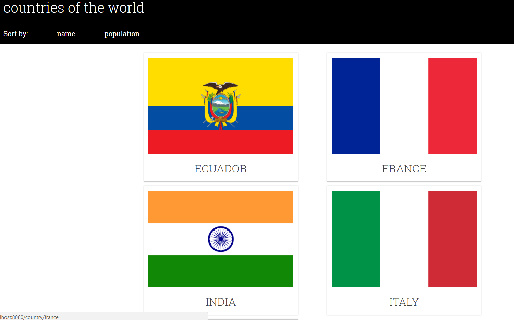

# Team Treehouse Project 5 - Countries of the World

## Summary

Project which was built as part of Team Treehouse Tech Degree. Building a Java
Spring Boot project which shows a selection of countries around the world on the
front end, enables the user to click on the country flag for more details and to
be able to sort the presentation of flags on the front end by either name or 
population size (in ascending order).

## Screenshot

